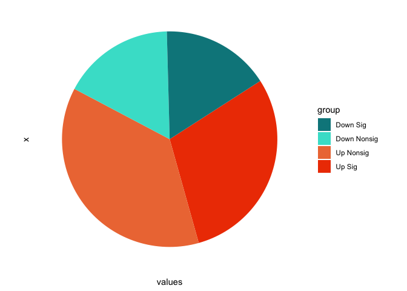
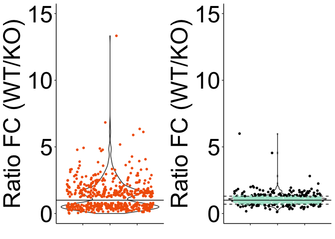

## Purpose

The goal of this section is to import the results of differential expression analysis from Supplementary Table 1 to identify Card9-dependent and Card9-independent Dectin-1 regulated genes.


```r
library(readxl)
library(ggplot2)
library(gridExtra)
library(dplyr)
```


## 1. Importing data

Importing DESeq output data for WT and Card9 KO neutrophils +/- curdlan from excel file. This sheet includes analysis of interaction of genotype x stimulation.


```r
library(readxl)
DifferentialExpression <- read_excel("DifferentialExpression.xlsx", 
    sheet = "CondCurdlan.GenotypeCard9mm")

# Making a new df with just the neutrophil expression values and padj value for interaction term
NormExp_Neutrophil <- DifferentialExpression[ , -c(1,3,4,5,6,7)]

# Renaming the padj value for the interaction term
colnames(NormExp_Neutrophil)[colnames(NormExp_Neutrophil)=="padj"] <- "padj_stimgeno_interaction"
```

Importing and merging in padj and FC values from WT neutrophil PBS vs. curdlan analysis, along with Card9 KO PBS vs. curdlan analysis (found in different sheets of same excel file)


```r
DifferentialExpression_WTNeut <- read_excel("DifferentialExpression.xlsx", 
    sheet = "WT-Neutrophil-curdlan.vs.PBS")
#Making a  new df from this with just the gene name, padj, logfc
WTNeut_stim_short <- DifferentialExpression_WTNeut[,c(2,4,8)]
#Renaming padj column to reflect analysis 
colnames(WTNeut_stim_short)[colnames(WTNeut_stim_short)=="padj"] <- "padj_WTstim"
#Merging two df by GeneName
NormExp_Neutrophil_merged <- merge(NormExp_Neutrophil,WTNeut_stim_short, by="GeneName")


DifferentialExpression_C9Neut <- read_excel("DifferentialExpression.xlsx", 
    sheet = "Card9-Neutrophil-curdlan.vs.PBS")
#Making a  new df from this with just the gene name, padj, logfc
C9Neut_stim_short <- DifferentialExpression_C9Neut[,c(2,4,8)]
#Renaming padj column to reflect analysis 
colnames(C9Neut_stim_short)[colnames(C9Neut_stim_short)=="padj"] <- "padj_C9stim"
#Merging two df by GeneName
NormExp_Neutrophil_merged <- merge(NormExp_Neutrophil_merged,C9Neut_stim_short, by="GeneName")

#print the column names of the new df
colnames(NormExp_Neutrophil_merged)
```

```
##  [1] "GeneName"                                                        
##  [2] "padj_stimgeno_interaction"                                       
##  [3] "WT.Neutrophil.unstimulated.replicate.A"                          
##  [4] "WT.Neutrophil.unstimulated.replicate.B"                          
##  [5] "WT.Neutrophil.unstimulated.replicate.C"                          
##  [6] "WT.Neutrophil.curdlan.replicate.A"                               
##  [7] "WT.Neutrophil.curdlan.replicate.B"                               
##  [8] "WT.Neutrophil.curdlan.replicate.C"                               
##  [9] "Card9.Neutrophil.unstimulated.replicate.A"                       
## [10] "Card9.Neutrophil.unstimulated.replicate.B"                       
## [11] "Card9.Neutrophil.unstimulated.replicate.C"                       
## [12] "Card9.Neutrophil.curdlan.replicate.A"                            
## [13] "Card9.Neutrophil.curdlan.replicate.B"                            
## [14] "Card9.Neutrophil.curdlan.replicate.C"                            
## [15] "logFC (WT-Neutrophil-curdlan / WT-Neutrophil-unstimulated)"      
## [16] "padj_WTstim"                                                     
## [17] "logFC (Card9-Neutrophil-curdlan / Card9-Neutrophil-unstimulated)"
## [18] "padj_C9stim"
```

## 2. Evaluating the number of differentially expressed genes in WT neutrophils with curdlan stimulation

Select genes with logFC > (absolute value(1.5)) and padj <0.05 for WT neutrophils +/- curdlan stimulation.


```r
#subsetting data by logfc threshold
NormExp_Neutrophil_merged$abs_logfc_WTstim <- abs(NormExp_Neutrophil_merged$`logFC (WT-Neutrophil-curdlan / WT-Neutrophil-unstimulated)`)
logfcthreshold <- 1.5
NormExp_Neutrophil_WTDE <- subset(NormExp_Neutrophil_merged, 
                                     NormExp_Neutrophil_merged[ ,"abs_logfc_WTstim"] > logfcthreshold)
#subsetting data by padj value
padj_threshold <- 0.05
NormExp_Neutrophil_WTDE <- subset(NormExp_Neutrophil_WTDE, 
                                     NormExp_Neutrophil_WTDE[,"padj_WTstim" ] < padj_threshold)

#focus on genes with significant expression levels by removing those with <100 in either condition
NormExp_Neutrophil_WTDE <- subset(NormExp_Neutrophil_WTDE,
                                  (NormExp_Neutrophil_WTDE[, "WT.Neutrophil.curdlan.replicate.A"] > 100) | (NormExp_Neutrophil_WTDE[, "WT.Neutrophil.unstimulated.replicate.A"] > 100) )

#1157 genes that meet both criteria
WTDE_genelist <- as.list(NormExp_Neutrophil_WTDE$GeneName)
length(WTDE_genelist)
```

```
## [1] 1157
```

```r
#773 genes are upregulated
NormExp_Neutrophil_WTDE_upreg <- subset(NormExp_Neutrophil_WTDE,
          NormExp_Neutrophil_WTDE[,"logFC (WT-Neutrophil-curdlan / WT-Neutrophil-unstimulated)"] > 1.5)
WTDE_upreg_genelist <- as.list(NormExp_Neutrophil_WTDE_upreg$GeneName)
length(WTDE_upreg_genelist)
```

```
## [1] 773
```

```r
#384 genes are downregulated
NormExp_Neutrophil_WTDE_downreg <- subset(NormExp_Neutrophil_WTDE,
          NormExp_Neutrophil_WTDE[,"logFC (WT-Neutrophil-curdlan / WT-Neutrophil-unstimulated)"] < -1.5)
WTDE_downreg_genelist <- as.list(NormExp_Neutrophil_WTDE_downreg$GeneName)
length(WTDE_downreg_genelist)
```

```
## [1] 384
```

```r
# 533 genes have significant padj for interaction term
NormExp_Neutrophil_WTDE_int <- subset(NormExp_Neutrophil_WTDE,
          NormExp_Neutrophil_WTDE[,"padj_stimgeno_interaction" ] < 0.05)
WTDE_int_genelist <- as.list(NormExp_Neutrophil_WTDE_int$GeneName)
length(WTDE_int_genelist)
```

```
## [1] 533
```

```r
# 344 genes have significant padj for interaction term AND are upregulated with stimulation
NormExp_Neutrophil_WTDE_int_upreg <- subset(NormExp_Neutrophil_WTDE_int,
          NormExp_Neutrophil_WTDE_int[,"logFC (WT-Neutrophil-curdlan / WT-Neutrophil-unstimulated)"] > 1.5)
WTDE_int_upreg_genelist <- as.list(NormExp_Neutrophil_WTDE_int_upreg$GeneName)
length(WTDE_int_upreg_genelist)
```

```
## [1] 344
```

```r
# 189 genes have significant padj for interaction term AND are downregulated with stimulation
NormExp_Neutrophil_WTDE_int_downreg <- subset(NormExp_Neutrophil_WTDE_int,
          NormExp_Neutrophil_WTDE_int[,"logFC (WT-Neutrophil-curdlan / WT-Neutrophil-unstimulated)"] < -1.5)
WTDE_int_downreg_genelist <- as.list(NormExp_Neutrophil_WTDE_int_downreg$GeneName)
length(WTDE_int_downreg_genelist)
```

```
## [1] 189
```

```r
# 624 genes have non-significant padj for interaction term
NormExp_Neutrophil_WTDE_intnonsig <- subset(NormExp_Neutrophil_WTDE,
          NormExp_Neutrophil_WTDE[,"padj_stimgeno_interaction" ] > 0.05)
WTDE_intnonsig_genelist <- as.list(NormExp_Neutrophil_WTDE_intnonsig$GeneName)
length(WTDE_intnonsig_genelist)
```

```
## [1] 624
```

```r
# 429 genes have non-significant padj for interaction term AND are upregulated with stimulation
NormExp_Neutrophil_WTDE_intnonsig_upreg <- subset(NormExp_Neutrophil_WTDE_intnonsig,
          NormExp_Neutrophil_WTDE_intnonsig[,"logFC (WT-Neutrophil-curdlan / WT-Neutrophil-unstimulated)"] > 1.5)
WTDE_intnonsig_upreg_genelist <- as.list(NormExp_Neutrophil_WTDE_intnonsig_upreg$GeneName)
length(WTDE_intnonsig_upreg_genelist)
```

```
## [1] 429
```

```r
# 195 genes have non-significant padj for interaction term AND are downregulated with stimulation
NormExp_Neutrophil_WTDE_intnonsig_downreg <- subset(NormExp_Neutrophil_WTDE_intnonsig,
          NormExp_Neutrophil_WTDE_intnonsig[,"logFC (WT-Neutrophil-curdlan / WT-Neutrophil-unstimulated)"] < -1.5)
WTDE_intnonsig_downreg_genelist <- as.list(NormExp_Neutrophil_WTDE_intnonsig_downreg$GeneName)
length(WTDE_intnonsig_downreg_genelist)
```

```
## [1] 195
```

```r
#make df with # generated from above:
df <- data.frame(
  group = c("Down Sig ","Down Nonsig ","Up Nonsig ","Up Sig "),
  values = c( 189, 195, 429, 344)
  )
df$group <- factor(df$group, levels=c("Down Sig ","Down Nonsig ","Up Nonsig ","Up Sig "))
head(df)
```

```
##          group values
## 1    Down Sig     189
## 2 Down Nonsig     195
## 3   Up Nonsig     429
## 4      Up Sig     344
```

```r
#generate pie chart
bp<- ggplot(df, aes(x="", y=values, fill=group))+
geom_bar(width = 1, stat = "identity")

pie <- bp + coord_polar("y", start=1)
pie + scale_fill_manual(values=c("turquoise4","turquoise","sienna2","orangered2")) + theme(axis.text = element_blank(),
        axis.ticks = element_blank(),
        panel.grid  = element_blank()) +
  theme(panel.background = element_blank())
```

<!-- -->

## 3. Plotting fold-change with stimulation in WT / Card9 KO cells 


```r
#Generating new columns for fold-change and ratio of fc with stimulation in WT cells / KO cells
NormExp_Neutrophil_WTDE_int$WT_FC <- 2^(NormExp_Neutrophil_WTDE_int[,"logFC (WT-Neutrophil-curdlan / WT-Neutrophil-unstimulated)"])
NormExp_Neutrophil_WTDE_int$C9_FC <- 2^(NormExp_Neutrophil_WTDE_int[,"logFC (Card9-Neutrophil-curdlan / Card9-Neutrophil-unstimulated)"])
NormExp_Neutrophil_WTDE_int$ratioFC <- NormExp_Neutrophil_WTDE_int[,"WT_FC"] /NormExp_Neutrophil_WTDE_int[,"C9_FC"]


NormExp_Neutrophil_WTDE_intnonsig$WT_FC <- 2^(NormExp_Neutrophil_WTDE_intnonsig[,"logFC (WT-Neutrophil-curdlan / WT-Neutrophil-unstimulated)"])
NormExp_Neutrophil_WTDE_intnonsig$C9_FC <- 2^(NormExp_Neutrophil_WTDE_intnonsig[,"logFC (Card9-Neutrophil-curdlan / Card9-Neutrophil-unstimulated)"])
NormExp_Neutrophil_WTDE_intnonsig$ratioFC <- NormExp_Neutrophil_WTDE_intnonsig[,"WT_FC"] /NormExp_Neutrophil_WTDE_intnonsig[,"C9_FC"]

# Generating basic violin plots
p_nonsig <- ggplot(NormExp_Neutrophil_WTDE_intnonsig, aes(x = 1, y=ratioFC))  +
  geom_violin()

p_sig <- ggplot(NormExp_Neutrophil_WTDE_int, aes(x = 1, y=ratioFC)) +
  geom_violin()


#sig final
p_sig_final <- p_sig + geom_jitter(shape=16, position=position_jitter(0.4), dotsize=0.05, fill = "#f26005", color = "#f26005") + 
  ylim(0,15) + 
   geom_hline(yintercept=1) +
    theme(panel.grid.major = element_blank(), panel.grid.minor = element_blank(), panel.background = element_blank(), axis.line = element_line(colour = "black"), axis.text.y = element_text(size = 35, color="black"), axis.text.x = element_text(size = 0, color="black"),
          axis.title.y= element_text(size = 35)) +
          labs( y ="Ratio FC (WT/KO)", x = " ")

#Here I am trying to make values between 0.7 and 1.3 colored while remainder are black 
NormExp_Neutrophil_WTDE_intnonsig$abs_diff <- abs(1- NormExp_Neutrophil_WTDE_intnonsig$ratioFC)
NormExp_Neutrophil_WTDE_intnonsig$cutoffTF <- with(NormExp_Neutrophil_WTDE_intnonsig, ifelse((abs_diff <= 0.3), T, F))
NormExp_Neutrophil_WTDE_intnonsig$cutoffcolor <- with(NormExp_Neutrophil_WTDE_intnonsig, ifelse((cutoffTF == T),"#ade3d0","black"))

#nonsig final
p_nonsig_final_condcolor <- p_nonsig + geom_jitter(shape=16, position=position_jitter(0.4), dotsize=0.05, color = factor(NormExp_Neutrophil_WTDE_intnonsig$cutoffcolor)) + 
    ylim(0,15) + 
  geom_hline(yintercept=1.3, linetype="dashed") +
  geom_hline(yintercept=0.7, linetype="dashed") +
  geom_hline(yintercept=1) +
    theme(panel.grid.major = element_blank(), panel.grid.minor = element_blank(), panel.background = element_blank(), axis.line = element_line(colour = "black"),
          axis.text.y = element_text(size = 35, color="black"), axis.text.x = element_text(size = 0, color="black"),
          axis.title.y= element_text(size = 35)) +
          labs( y ="Ratio FC (WT/KO)", x = " ")

#panel
grid.arrange(p_sig_final, p_nonsig_final_condcolor, nrow=1)
```

<!-- -->


## 4. Generating lists of Card9-dependent and -independent Dectin-1 regulated genes 

Among DE genes (padj <0.05 & logFC >1.5 or <-1.5):

Card9-dependent = padj for interaction term < 0.05

Card9-independent = padj for interaction term > 0.05 & ratio of fold change between 1.3 and 0.7


```r
#Card9-dependent gene list: 533
Card9_dep <- NormExp_Neutrophil_WTDE_int
Card9_dep_genelist <- as.list(Card9_dep$GeneName)
length(Card9_dep_genelist)
```

```
## [1] 533
```

```r
#Card9-independent gene list: 567 (reduced from 624)
#with ratioFC between 0.7 and 1.3
Card9_ind <- subset(NormExp_Neutrophil_WTDE_intnonsig, 
                    (NormExp_Neutrophil_WTDE_intnonsig[,"ratioFC"] > 0.7 ) | (NormExp_Neutrophil_WTDE_intnonsig[,"ratioFC"] > 1.3 ))
Card9_ind_genelist <- as.list(Card9_ind$GeneName)
length(Card9_ind_genelist)
```

```
## [1] 567
```

## SessionInfo


```r
sessionInfo()
```

```
## R version 3.6.0 (2019-04-26)
## Platform: x86_64-apple-darwin15.6.0 (64-bit)
## Running under: macOS Mojave 10.14.3
## 
## Matrix products: default
## BLAS:   /Library/Frameworks/R.framework/Versions/3.6/Resources/lib/libRblas.0.dylib
## LAPACK: /Library/Frameworks/R.framework/Versions/3.6/Resources/lib/libRlapack.dylib
## 
## locale:
## [1] en_US.UTF-8/en_US.UTF-8/en_US.UTF-8/C/en_US.UTF-8/en_US.UTF-8
## 
## attached base packages:
## [1] stats     graphics  grDevices utils     datasets  methods   base     
## 
## other attached packages:
## [1] dplyr_0.8.3   gridExtra_2.3 ggplot2_3.2.1 readxl_1.3.1 
## 
## loaded via a namespace (and not attached):
##  [1] Rcpp_1.0.2       knitr_1.25       magrittr_1.5     tidyselect_0.2.5
##  [5] munsell_0.5.0    colorspace_1.4-1 R6_2.4.0         rlang_0.4.0     
##  [9] stringr_1.4.0    tools_3.6.0      grid_3.6.0       gtable_0.3.0    
## [13] xfun_0.10        withr_2.1.2      htmltools_0.4.0  assertthat_0.2.1
## [17] yaml_2.2.0       lazyeval_0.2.2   digest_0.6.21    tibble_2.1.3    
## [21] crayon_1.3.4     purrr_0.3.2      glue_1.3.1       evaluate_0.14   
## [25] rmarkdown_1.16   labeling_0.3     stringi_1.4.3    compiler_3.6.0  
## [29] pillar_1.4.2     cellranger_1.1.0 scales_1.0.0     pkgconfig_2.0.3
```


