## Purpose

The goal of this section is to perform pathway enrichment analysis using ReactomePA for Card9-dependent and Card9-independent Dectin-1 regulated genes (identified in PART1). In addition, this section generates heatmaps for selected differentially expressed genes in pathways of interest.


```r
library(DOSE)
library(ReactomePA)
library(clusterProfiler)
library(org.Mm.eg.db)
library(ggplot2)
library(pheatmap)
library(dplyr)
```

## 1. Format data for pathway enrichment analysis


```r
#Use df for Card9 dependent (Card9_dep) and Card9 independent (Card9_ind) generated in PART1
load(file = "Card9_dep.Rdata")
load(file = "Card9_ind.Rdata")

dim(Card9_dep)
```

```
## [1] 533  22
```

```r
dim(Card9_ind)
```

```
## [1] 567  25
```

```r
#Subset to only upregulated genes
Card9_dep_up <- subset(Card9_dep, Card9_dep[,"logFC (WT-Neutrophil-curdlan / WT-Neutrophil-unstimulated)"] > 0)
Card9_ind_up <- subset(Card9_ind, Card9_ind[,"logFC (WT-Neutrophil-curdlan / WT-Neutrophil-unstimulated)"] > 0)

#344 upregulated Card9-dep genes
dim(Card9_dep_up)
```

```
## [1] 344  22
```

```r
#413 upregulated Card9-ind genes
dim(Card9_ind_up)
```

```
## [1] 413  25
```

```r
#Convert gene name to Entrez ID, manually annotate genes which didn't match
#bitr(geneID, fromType, toType, OrgDb, drop = TRUE)
nonsig.df <- bitr(Card9_ind_up$GeneName, fromType = "SYMBOL", toType = "ENTREZID", OrgDb = org.Mm.eg.db, drop = FALSE)
sig.df <- bitr(Card9_dep_up$GeneName, fromType = "SYMBOL", toType = "ENTREZID", OrgDb = org.Mm.eg.db, drop = FALSE)
```

## 2. Proceed with ReactomePA analysis

### Card9-independent genes


```r
nonsig.df_list <- as.vector(nonsig.df$ENTREZID)
Card9nonsig <- enrichPathway(gene = nonsig.df_list, organism = "mouse", pvalueCutoff=0.05, readable=T)
head(as.data.frame(Card9nonsig))
```

```
##                          ID
## R-MMU-917937   R-MMU-917937
## R-MMU-8953897 R-MMU-8953897
## R-MMU-2262752 R-MMU-2262752
## R-MMU-432720   R-MMU-432720
## R-MMU-449147   R-MMU-449147
## R-MMU-3371497 R-MMU-3371497
##                                                             Description
## R-MMU-917937                                  Iron uptake and transport
## R-MMU-8953897                    Cellular responses to external stimuli
## R-MMU-2262752                              Cellular responses to stress
## R-MMU-432720                                Lysosome Vesicle Biogenesis
## R-MMU-449147                                  Signaling by Interleukins
## R-MMU-3371497 HSP90 chaperone cycle for steroid hormone receptors (SHR)
##               GeneRatio  BgRatio       pvalue     p.adjust       qvalue
## R-MMU-917937     10/197  56/8755 3.832318e-07 0.0002303223 0.0002073486
## R-MMU-8953897    25/197 413/8755 5.562195e-06 0.0016714397 0.0015047202
## R-MMU-2262752    21/197 335/8755 1.962764e-05 0.0039320706 0.0035398622
## R-MMU-432720      6/197  33/8755 8.024175e-05 0.0113800903 0.0102449714
## R-MMU-449147     15/197 219/8755 1.199181e-04 0.0113800903 0.0102449714
## R-MMU-3371497     7/197  51/8755 1.313538e-04 0.0113800903 0.0102449714
##                                                                                                                                                                 geneID
## R-MMU-917937                                                                                        Atp6v0c/Atp6v1a/Atp6v1d/Atp6v1e1/Fbxl5/Fth1/Hmox1/Hmox2/Mcoln1/Ubc
## R-MMU-8953897 Cdkn1a/Chmp2b/Dnaja1/Dnajb1/Egln3/Fos/Hif1a/Hmga1/Hsp90aa1/Hspa8/Hspa9/Kdm6b/P4hb/Prdx1/Prdx6/Ptges3/Rheb/Rragc/Rragd/Seh1l/Tuba1c/Tubb1/Txnrd1/Ubc/Ubn1
## R-MMU-2262752                         Cdkn1a/Dnaja1/Dnajb1/Egln3/Fos/Hif1a/Hmga1/Hsp90aa1/Hspa8/Hspa9/Kdm6b/P4hb/Prdx1/Prdx6/Ptges3/Seh1l/Tuba1c/Tubb1/Txnrd1/Ubc/Ubn1
## R-MMU-432720                                                                                                                            Cltc/Ctsz/Gns/Hspa8/M6pr/Vamp2
## R-MMU-449147                                                                          Csf1/Csf3/Dusp4/Fos/Il1r2/Il1rap/Irak2/Lif/Nfkbib/Osm/P4hb/Stx3/Tollip/Ubc/Vamp2
## R-MMU-3371497                                                                                                         Dnaja1/Dnajb1/Hsp90aa1/Hspa8/Ptges3/Tuba1c/Tubb1
##               Count
## R-MMU-917937     10
## R-MMU-8953897    25
## R-MMU-2262752    21
## R-MMU-432720      6
## R-MMU-449147     15
## R-MMU-3371497     7
```

```r
class(Card9nonsig)
```

```
## [1] "enrichResult"
## attr(,"package")
## [1] "DOSE"
```

```r
barplot(Card9nonsig, showCategory = 20)
```

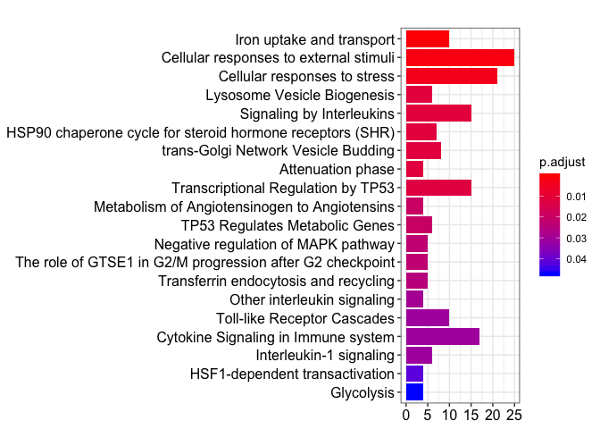<!-- -->

```r
emapplot(Card9nonsig)
```

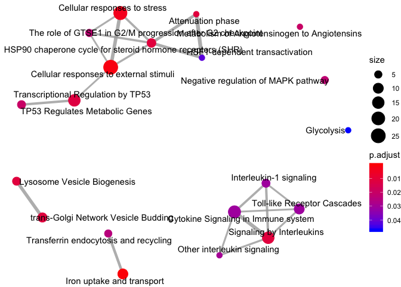<!-- -->

```r
cnetplot(Card9nonsig, showCategory = 20, node_label = FALSE, colorEdge = TRUE)
```

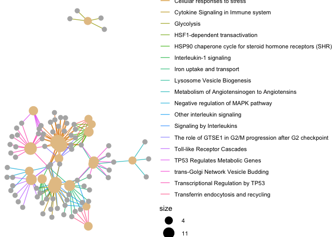<!-- -->

```r
#write.csv(Card9nonsig, "Card9nonsig.csv")
```

### Card9-dependent genes


```r
sig.df_list <- as.vector(sig.df$ENTREZID)
Card9sig <- enrichPathway(gene = sig.df_list, organism = "mouse", pvalueCutoff=0.05, readable=T)
head(as.data.frame(Card9sig))
```

```
##                          ID                           Description
## R-MMU-446652   R-MMU-446652        Interleukin-1 family signaling
## R-MMU-168898   R-MMU-168898           Toll-like Receptor Cascades
## R-MMU-166166   R-MMU-166166       MyD88-independent TLR4 cascade 
## R-MMU-937061   R-MMU-937061 TRIF(TICAM1)-mediated TLR4 signaling 
## R-MMU-1280215 R-MMU-1280215   Cytokine Signaling in Immune system
## R-MMU-9020702 R-MMU-9020702               Interleukin-1 signaling
##               GeneRatio  BgRatio       pvalue     p.adjust       qvalue
## R-MMU-446652     12/189  63/8755 7.370107e-09 3.611352e-06 3.103203e-06
## R-MMU-168898     16/189 134/8755 2.582100e-08 6.003585e-06 5.158827e-06
## R-MMU-166166     13/189  89/8755 4.900885e-08 6.003585e-06 5.158827e-06
## R-MMU-937061     13/189  89/8755 4.900885e-08 6.003585e-06 5.158827e-06
## R-MMU-1280215    24/189 322/8755 9.772845e-08 8.385977e-06 7.205995e-06
## R-MMU-9020702    10/189  51/8755 1.026854e-07 8.385977e-06 7.205995e-06
##                                                                                                                                                            geneID
## R-MMU-446652                                                                              Il1a/Il1b/Il1rn/Irak3/Map3k8/Mapk8/Nfkb1/Nfkb2/Nfkbia/Ripk2/Sqstm1/Tbk1
## R-MMU-168898                                                         Birc3/Cd14/Jun/Map3k8/Mapk7/Mapk8/Mapkapk2/Nfkb1/Nfkb2/Nfkbia/Ripk2/Tank/Tbk1/Tlr2/Tlr7/Tlr9
## R-MMU-166166                                                                        Birc3/Cd14/Jun/Map3k8/Mapk7/Mapk8/Mapkapk2/Nfkb1/Nfkb2/Nfkbia/Ripk2/Tank/Tbk1
## R-MMU-937061                                                                        Birc3/Cd14/Jun/Map3k8/Mapk7/Mapk8/Mapkapk2/Nfkb1/Nfkb2/Nfkbia/Ripk2/Tank/Tbk1
## R-MMU-1280215 Birc3/Brwd1/Il10ra/Il1a/Il1b/Il1rn/Il23a/Irak3/Jun/Map3k8/Mapk7/Mapk8/Mapkapk2/Nfkb1/Nfkb2/Nfkbia/Ptpn2/Relb/Ripk2/Sqstm1/Tbk1/Tnf/Tnfrsf1b/Tnfrsf8
## R-MMU-9020702                                                                                        Il1a/Il1b/Il1rn/Irak3/Map3k8/Nfkb1/Nfkb2/Nfkbia/Ripk2/Sqstm1
##               Count
## R-MMU-446652     12
## R-MMU-168898     16
## R-MMU-166166     13
## R-MMU-937061     13
## R-MMU-1280215    24
## R-MMU-9020702    10
```

```r
class(Card9sig)
```

```
## [1] "enrichResult"
## attr(,"package")
## [1] "DOSE"
```

```r
barplot(Card9sig, showCategory = 20)
```

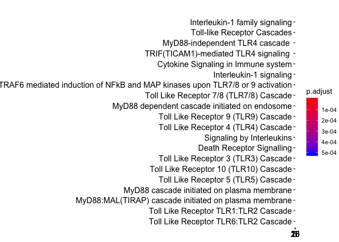<!-- -->

```r
emapplot(Card9sig)
```

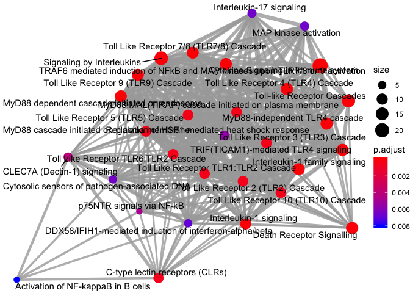<!-- -->

```r
cnetplot(Card9sig, showCategory = 20, node_label = FALSE, colorEdge = TRUE)
```

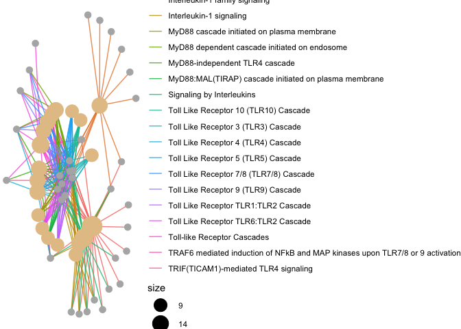<!-- -->

```r
#write.csv(Card9sig, "Card9sig.csv")
```


## 3. Generate heatmaps


### Card9-independent 


```r
#Creating DF with only the expression values and with the gene names as the rownames
Card9ind_hm <- Card9_ind_up
Card9ind_hm$uGeneName <- make.names(Card9ind_hm$GeneName, unique=TRUE)
rownames(Card9ind_hm) <- Card9ind_hm$uGeneName
Card9ind_hm <- Card9ind_hm[, c(3:14)]

#Generating gene lists of interest based on pathways
Genelist_1 <- c("Osm", "Lif", "Csf1", "Il1r2", "Tollip", "Nfkbib")
Genelist_2 <- c("Ctsz", "Vamp2", "Gns", "M6pr", "Cltc")
Genelist_3 <- c("Ptges3", "Hif1a", "Hyou1", "Prdx6", "Prdx1")
Genelist_4 <- c("Pfkp", "Pfkl", "Tpi1")
Genelist_5 <- c("Cd93", "Vegfa", "Raf1", "Sgpl1")

#Generating df subsets
Card9ind_hm_1 <- subset(Card9ind_hm, rownames(Card9ind_hm) %in% Genelist_1)
Card9ind_hm_2 <- subset(Card9ind_hm, rownames(Card9ind_hm) %in% Genelist_2)
Card9ind_hm_3 <- subset(Card9ind_hm, rownames(Card9ind_hm) %in% Genelist_3)
Card9ind_hm_4 <- subset(Card9ind_hm, rownames(Card9ind_hm) %in% Genelist_4)
Card9ind_hm_5 <- subset(Card9ind_hm, rownames(Card9ind_hm) %in% Genelist_5)

#Generating hm
pheatmap(Card9ind_hm_1, scale = "row", cluster_rows = FALSE, cluster_cols = FALSE, clustering_distance_rows = "correlation", 
	         cutree_rows = 1, 
	         cellwidth = 8, 
	         cellheight = 10, 
	         fontsize = 10, 
	         show_colnames = FALSE, show_rownames = TRUE, fontsize_row = 8, 
	         legend = TRUE, legend_breaks = c(-2,0,2))
```

<!-- -->

```r
pheatmap(Card9ind_hm_2, scale = "row", cluster_rows = FALSE, cluster_cols = FALSE, clustering_distance_rows = "correlation", 
	         cutree_rows = 1, 
	         cellwidth = 8, 
	         cellheight = 10, 
	         fontsize = 10, 
	         show_colnames = FALSE, show_rownames = TRUE, fontsize_row = 8, 
	         legend = TRUE, legend_breaks = c(-2,0,2))
```

<!-- -->

```r
pheatmap(Card9ind_hm_3, scale = "row", cluster_rows = FALSE, cluster_cols = FALSE, clustering_distance_rows = "correlation", 
	         cutree_rows = 1, 
	         cellwidth = 8, 
	         cellheight = 10, 
	         fontsize = 10, 
	         show_colnames = FALSE, show_rownames = TRUE, fontsize_row = 8, 
	         legend = TRUE, legend_breaks = c(-2,0,2))
```

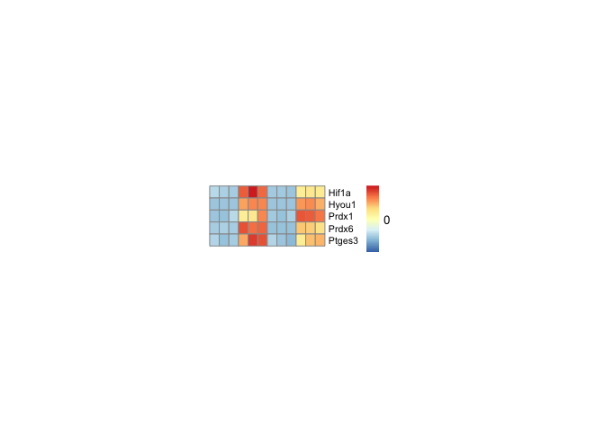<!-- -->

```r
pheatmap(Card9ind_hm_4, scale = "row", cluster_rows = FALSE, cluster_cols = FALSE, clustering_distance_rows = "correlation", 
	         cutree_rows = 1, 
	         cellwidth = 8, 
	         cellheight = 10, 
	         fontsize = 10, 
	         show_colnames = FALSE, show_rownames = TRUE, fontsize_row = 8, 
	         legend = TRUE, legend_breaks = c(-2,0,2))
```

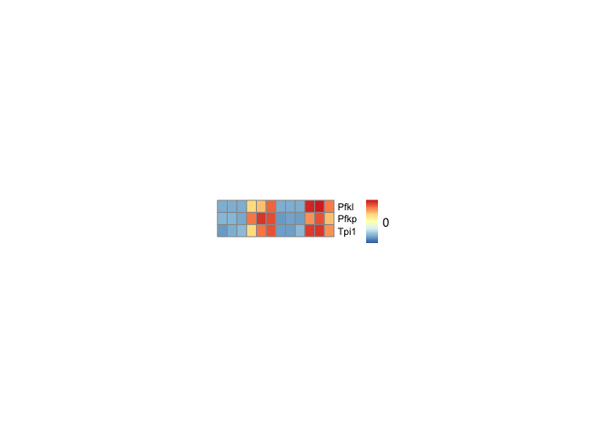<!-- -->

```r
pheatmap(Card9ind_hm_5, scale = "row", cluster_rows = FALSE, cluster_cols = FALSE, clustering_distance_rows = "correlation", 
	         cutree_rows = 1, 
	         cellwidth = 8, 
	         cellheight = 10, 
	         fontsize = 10, 
	         show_colnames = FALSE, show_rownames = TRUE, fontsize_row = 8, 
	         legend = TRUE, legend_breaks = c(-2,0,2))
```

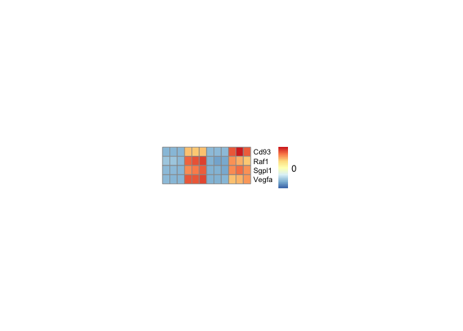<!-- -->

### Card9-dependent 


```r
#Creating DF with only the expression values and with the gene names as the rownames
Card9dep_hm <- Card9_dep_up
Card9dep_hm$uGeneName <- make.names(Card9dep_hm$GeneName, unique=TRUE)
rownames(Card9dep_hm) <- Card9dep_hm$uGeneName
Card9dep_hm <- Card9dep_hm[, c(3:14)]

#Generating gene lists of interest based on pathways
geneset_dep_1 <- c("Nfkb1", "Nfkb2", "Relb", "Malt1")
geneset_dep_2 <- c("Mapk8", "Map3k8", "Mapkapk2")
geneset_dep_3 <- c("Il1b", "Il1a", "Il23", "Nlrp3")
geneset_dep_4 <-c("Birc3", "Tnf", "Tnfaip3", "Traf1")

#Generating df subsets
Card9dep_hm_1 <- subset(Card9dep_hm, rownames(Card9dep_hm) %in% geneset_dep_1)
Card9dep_hm_2 <- subset(Card9dep_hm, rownames(Card9dep_hm) %in% geneset_dep_2)
Card9dep_hm_3 <- subset(Card9dep_hm, rownames(Card9dep_hm) %in% geneset_dep_3)
Card9dep_hm_4 <- subset(Card9dep_hm, rownames(Card9dep_hm) %in% geneset_dep_4)

#Generating hm
pheatmap(Card9dep_hm_1, scale = "row", cluster_rows = FALSE, cluster_cols = FALSE, clustering_distance_rows = "correlation", 
	         cutree_rows = 1, 
	         cellwidth = 8, 
	         cellheight = 10, 
	         fontsize = 10, 
	         show_colnames = FALSE, show_rownames = TRUE, fontsize_row = 8, 
	         legend = TRUE, legend_breaks = c(-2,0,2))
```

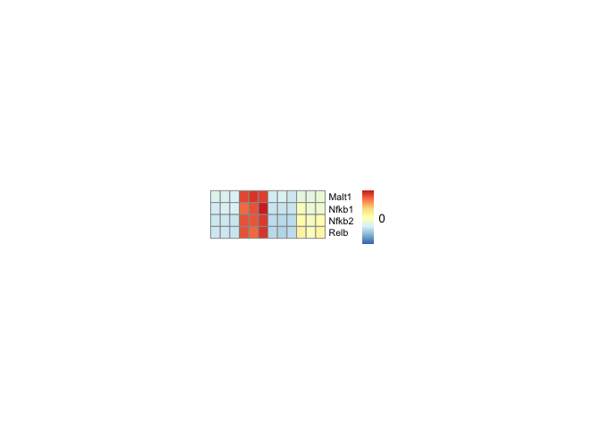<!-- -->

```r
pheatmap(Card9dep_hm_2, scale = "row", cluster_rows = FALSE, cluster_cols = FALSE, clustering_distance_rows = "correlation", 
	         cutree_rows = 1, 
	         cellwidth = 8, 
	         cellheight = 10, 
	         fontsize = 10, 
	         show_colnames = FALSE, show_rownames = TRUE, fontsize_row = 8, 
	         legend = TRUE, legend_breaks = c(-2,0,2))
```

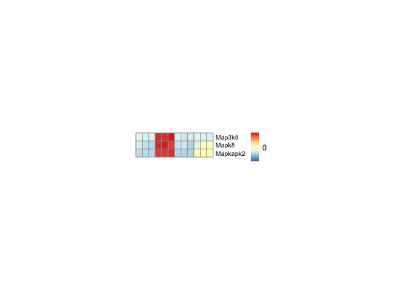<!-- -->

```r
pheatmap(Card9dep_hm_3, scale = "row", cluster_rows = FALSE, cluster_cols = FALSE, clustering_distance_rows = "correlation", 
	         cutree_rows = 1, 
	         cellwidth = 8, 
	         cellheight = 10, 
	         fontsize = 10, 
	         show_colnames = FALSE, show_rownames = TRUE, fontsize_row = 8, 
	         legend = TRUE, legend_breaks = c(-2,0,2))
```

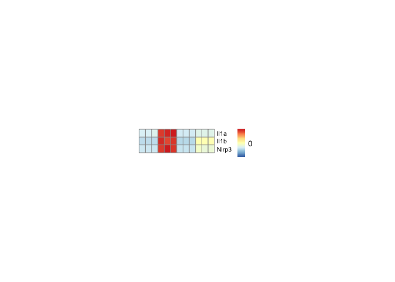<!-- -->

```r
pheatmap(Card9dep_hm_4, scale = "row", cluster_rows = FALSE, cluster_cols = FALSE, clustering_distance_rows = "correlation", 
	         cutree_rows = 1, 
	         cellwidth = 8, 
	         cellheight = 10, 
	         fontsize = 10, 
	         show_colnames = FALSE, show_rownames = TRUE, fontsize_row = 8, 
	         legend = TRUE, legend_breaks = c(-2,0,2))
```

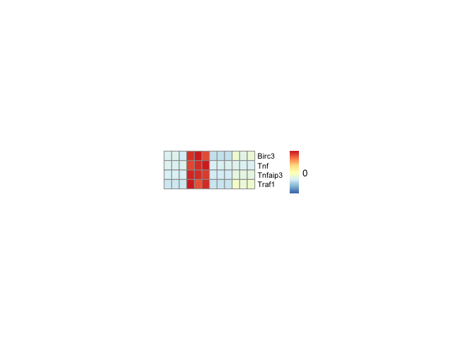<!-- -->


## SessionInfo


```r
sessionInfo()
```

```
## R version 3.6.0 (2019-04-26)
## Platform: x86_64-apple-darwin15.6.0 (64-bit)
## Running under: macOS Mojave 10.14.3
## 
## Matrix products: default
## BLAS:   /Library/Frameworks/R.framework/Versions/3.6/Resources/lib/libRblas.0.dylib
## LAPACK: /Library/Frameworks/R.framework/Versions/3.6/Resources/lib/libRlapack.dylib
## 
## locale:
## [1] en_US.UTF-8/en_US.UTF-8/en_US.UTF-8/C/en_US.UTF-8/en_US.UTF-8
## 
## attached base packages:
## [1] parallel  stats4    stats     graphics  grDevices utils     datasets 
## [8] methods   base     
## 
## other attached packages:
##  [1] dplyr_0.8.3            pheatmap_1.0.12        ggplot2_3.2.1         
##  [4] org.Mm.eg.db_3.8.2     AnnotationDbi_1.47.1   IRanges_2.19.16       
##  [7] S4Vectors_0.23.25      Biobase_2.45.1         BiocGenerics_0.31.6   
## [10] clusterProfiler_3.13.0 ReactomePA_1.29.0      DOSE_3.11.2           
## 
## loaded via a namespace (and not attached):
##  [1] enrichplot_1.5.2    bit64_0.9-7         RColorBrewer_1.1-2 
##  [4] progress_1.2.2      httr_1.4.1          tools_3.6.0        
##  [7] backports_1.1.5     R6_2.4.0            DBI_1.0.0          
## [10] lazyeval_0.2.2      colorspace_1.4-1    withr_2.1.2        
## [13] graphite_1.31.0     tidyselect_0.2.5    gridExtra_2.3      
## [16] prettyunits_1.0.2   bit_1.1-14          compiler_3.6.0     
## [19] graph_1.63.0        xml2_1.2.2          labeling_0.3       
## [22] triebeard_0.3.0     checkmate_1.9.4     scales_1.0.0       
## [25] ggridges_0.5.1      rappdirs_0.3.1      stringr_1.4.0      
## [28] digest_0.6.21       rmarkdown_1.16      pkgconfig_2.0.3    
## [31] htmltools_0.4.0     rlang_0.4.0         RSQLite_2.1.2      
## [34] gridGraphics_0.4-1  farver_1.1.0        jsonlite_1.6       
## [37] BiocParallel_1.19.3 GOSemSim_2.11.0     magrittr_1.5       
## [40] ggplotify_0.0.4     GO.db_3.8.2         Matrix_1.2-17      
## [43] Rcpp_1.0.2          munsell_0.5.0       viridis_0.5.1      
## [46] lifecycle_0.1.0     stringi_1.4.3       yaml_2.2.0         
## [49] ggraph_2.0.0        MASS_7.3-51.4       plyr_1.8.4         
## [52] qvalue_2.17.0       grid_3.6.0          blob_1.2.0         
## [55] ggrepel_0.8.1       DO.db_2.9           crayon_1.3.4       
## [58] lattice_0.20-38     graphlayouts_0.5.0  cowplot_1.0.0      
## [61] splines_3.6.0       hms_0.5.1           zeallot_0.1.0      
## [64] knitr_1.25          pillar_1.4.2        fgsea_1.11.1       
## [67] igraph_1.2.4.1      reshape2_1.4.3      fastmatch_1.1-0    
## [70] glue_1.3.1          evaluate_0.14       data.table_1.12.2  
## [73] BiocManager_1.30.7  vctrs_0.2.0         tweenr_1.0.1       
## [76] urltools_1.7.3      gtable_0.3.0        purrr_0.3.2        
## [79] polyclip_1.10-0     tidyr_1.0.0         assertthat_0.2.1   
## [82] xfun_0.10           ggforce_0.3.1       europepmc_0.3      
## [85] tidygraph_1.1.2     reactome.db_1.68.0  viridisLite_0.3.0  
## [88] tibble_2.1.3        rvcheck_0.1.5       memoise_1.1.0
```


