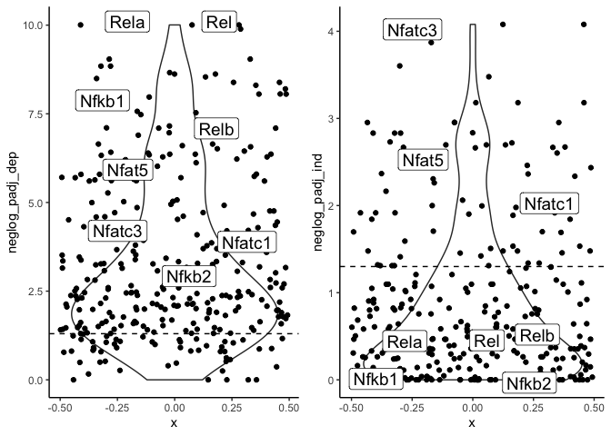

## Purpose

PART3/4: The goal of these sections is to predict which transcription factors may regulate Card9-dependent and Card9-independent Dectin-1 regulated genes. To do this, we are using ImmGen ATAC-seq data to identify open chromatin regions in our cell type of interest (BM neutrophils) and the predicted transcription factor (TF) binding sites in these open regions. This information is then used with a pathway enrichment analysis approach to identify those predicted TF sites that are overrepresented near genes of one group or the other. 

In PART3, we generated our reference of gene-TF pairs based on ATAC-seq data. In PART4, we are running the enrichment analysis


```r
library(devtools)
library(Biobase)
library(goseq)
library(DESeq2)
library(org.Hs.eg.db)
library(org.Mm.eg.db)
library(geneLenDataBase)
library(tidyr)
library(dplyr)
library(cowplot)
library(ggplot2)
library(ggrepel)
library(readxl)
```


## 1. Loading and formating ATAC-seq data from PART3 to use as reference


```r
#Load tbl_3 aka "Immgen_ATACSeq_GNBM_OCR_Compiled_GN10cutoff.Rdata" from PART3
start_time1 <- Sys.time()
load(file = "Immgen_ATACSeq_GNBM_OCR_Compiled_GN10cutoff.Rdata")
end_time1 <- Sys.time()
end_time1 - start_time1
```

```
## Time difference of 19.61608 secs
```

```r
#checking dimensions and colnames of tbl_3
dim(tbl_3)
```

```
## [1] 4795672      19
```

```r
colnames(tbl_3)
```

```
##  [1] "id"                              "OCR ID"                         
##  [3] "Chr"                             "OCR Start"                      
##  [5] "OCR End"                         "OCR Summit"                     
##  [7] "mm10_60way_phastCons_scores"     "minus_log10_bestPvalue"         
##  [9] "Included in systematic analysis" "TSS"                            
## [11] "Genes within 100Kb"              "Cis associated genes"           
## [13] "signedLogPvalues"                "TF ID"                          
## [15] "TF Name"                         "Score"                          
## [17] "GN_BM"                           "Genes.within.100kb"             
## [19] "TF_name_space"
```

```r
#creating new tbl_4 with only genes within 100kb and TF names
tbl_4 <- tbl_3[,c("Genes.within.100kb","TF_name_space")]
dim(tbl_4)
```

```
## [1] 4795672       2
```

```r
#duplicate and change column names
tbl_4_1 <- tbl_4
tbl_4_1$Category <- tbl_4_1$TF_name_space
tbl_4_1$gene <- tbl_4_1$Genes.within.100kb
tbl_4_1 <- tbl_4_1[,c(3,4)]
tbl_4_2 <- as.data.frame(tbl_4_1)
head(tbl_4_2)
```

```
##   Category gene
## 1     Ctcf H60c
## 2     Klf4 H60c
## 3      Sp2 H60c
## 4     Klf5 H60c
## 5   Zfp148 H60c
## 6      Sp6 H60c
```

## 2. Loading Card9-independent and dependent gene information from PART1

For Card9-independent and dependent genes, we are using both up and downregulated DE genes.


```r
#Load Card9_dep and Card9_ind R files from PART1  - including up and downregulated genes
load(file = "Card9_dep.Rdata")
load(file = "Card9_ind.Rdata")
```

## 3. Run analysis for Card9-dependent genes


```r
#generate de.genes list
de.genes <- Card9_dep$GeneName

#I need a list of all of the genes now. Loading original differential expression data
DifferentialExpression_WTNeut <- read_excel("DifferentialExpression.xlsx", 
    sheet = "WT-Neutrophil-curdlan.vs.PBS")
assayed.genes <- DifferentialExpression_WTNeut$GeneName

#533 card9-dependent candidates, 14697 total genes in list
length(de.genes)
```

```
## [1] 533
```

```r
length(assayed.genes)
```

```
## [1] 14697
```

```r
#Give value of 1 or 0 depending on whether gene is in the de.gene list
gene.vector=as.integer(assayed.genes%in%de.genes)
names(gene.vector) = make.names(assayed.genes, unique=TRUE)
head(gene.vector)
```

```
##   Ccl3   M6pr    Ubc Slc3a2   Csf1 Sqstm1 
##      1      0      0      0      0      1
```

```r
#generating probability weighting function using nullp from goseq
pwf = nullp(gene.vector, "mm9", "geneSymbol")
```

```r
#running goseq analyser using custom gene2cat (needs to be a dataframe)
TEST_dep = goseq(pwf, "mm9", "geneSymbol", gene2cat=tbl_4_2)
head(TEST_dep)
```

```
##     category over_represented_pvalue under_represented_pvalue numDEInCat
## 242    Esrrg            5.888272e-14                        1        195
## 240    Esrra            4.088432e-13                        1        172
## 868      Rel            8.055955e-13                        1        195
## 939  Smarcc1            9.856266e-13                        1        246
## 737    Nr5a1            1.004064e-12                        1        174
## 738    Nr5a2            1.004064e-12                        1        174
##     numInCat
## 242     2979
## 240     2555
## 868     3057
## 939     4199
## 737     2623
## 738     2623
```

```r
#Correcting for multiple comparisons on overrepresented categories using Benj. Hochberg method
TEST_dep$padj_over <- p.adjust(TEST_dep$over_represented_pvalue, method="BH")

#Subset based on adjusted p-values < 0.05
TF_card9_dep <- subset(TEST_dep, TEST_dep[,"padj_over"]<0.05)
write.csv(TF_card9_dep, "TF_card9_dep.csv")
```


## 4. Run analysis for Card9-independent genes


```r
#generate de.genes list
de.genes <- Card9_ind$GeneName

#assayed.genes already generated
#567 card9-dependent candidates, 14697 total genes in list
length(de.genes)
```

```
## [1] 567
```

```r
length(assayed.genes)
```

```
## [1] 14697
```

```r
#Give value of 1 or 0 depending on whether gene is in the de.gene list
gene.vector=as.integer(assayed.genes%in%de.genes)
names(gene.vector) = make.names(assayed.genes, unique=TRUE)
head(gene.vector)
```

```
##   Ccl3   M6pr    Ubc Slc3a2   Csf1 Sqstm1 
##      0      1      1      1      1      0
```

```r
#generating probability weighting function using nullp from goseq
pwf = nullp(gene.vector, "mm9", "geneSymbol")
```

```r
#running goseq analyser using custom gene2cat (needs to be a dataframe)
TEST_ind = goseq(pwf, "mm9", "geneSymbol", gene2cat=tbl_4_2)
head(TEST_ind)
```

```
##      category over_represented_pvalue under_represented_pvalue numDEInCat
## 1053    Tcfe3            1.083824e-07                1.0000000        169
## 271       Fos            3.646668e-07                1.0000000        184
## 835    Pou5f1            3.924357e-07                1.0000000        116
## 525      Jund            5.559170e-07                1.0000000        156
## 659    Nfatc4            1.311522e-06                0.9999995        120
## 658    Nfatc3            1.345489e-06                0.9999995        120
##      numInCat
## 1053     3131
## 271      3532
## 835      1961
## 525      2901
## 659      2094
## 658      2095
```

```r
#Correcting for multiple comparisons on overrepresented categories using Benj. Hochberg method
TEST_ind$padj_over <- p.adjust(TEST_ind$over_represented_pvalue, method="BH")

#Subset based on adjusted p-values < 0.05
TF_card9_ind <- subset(TEST_ind, TEST_ind[,"padj_over"]<0.05)
#129 enriched TFs
dim(TF_card9_ind)
```

```
## [1] 129   6
```

```r
write.csv(TF_card9_ind, "TF_card9_ind.csv")
```

## 4. Make file with results from both with -log(adjusted p-val)


```r
TEST_ind$padj_over_ind <- TEST_ind$padj_over
TEST_dep$padj_over_dep <- TEST_dep$padj_over

combined_res <- merge(TEST_ind, TEST_dep, by = "category")
combined_res$neglog_padj_ind <- -log10(combined_res$padj_over_ind)
combined_res$neglog_padj_dep <- -log10(combined_res$padj_over_dep)
colnames(combined_res)
```

```
##  [1] "category"                   "over_represented_pvalue.x" 
##  [3] "under_represented_pvalue.x" "numDEInCat.x"              
##  [5] "numInCat.x"                 "padj_over.x"               
##  [7] "padj_over_ind"              "over_represented_pvalue.y" 
##  [9] "under_represented_pvalue.y" "numDEInCat.y"              
## [11] "numInCat.y"                 "padj_over.y"               
## [13] "padj_over_dep"              "neglog_padj_ind"           
## [15] "neglog_padj_dep"
```

```r
combined_res_hm <- combined_res[, c(1, 14, 15)]
colnames(combined_res_hm)
```

```
## [1] "category"        "neglog_padj_ind" "neglog_padj_dep"
```

## 5. Generate plots of -log(adjusted p-val) for each set


```r
#Generate list for plotting NFAT and NFkb family genes
label_list <- c('Nfatc1', 'Nfatc2', 'Nfatc3', 'Nfatc4', 'Nfat5', 'Rel', 'Relb', 'Rela', 'Nfkb1', 'Nfkb2')
```


```r
pos <- position_jitter(width = 0.5)

#violin plot of c9-independent genes -logpvals
p_ind2 <- ggplot(combined_res_hm, aes(x = 0, y=neglog_padj_ind)) +
  geom_violin() +
  geom_point(
    position = pos
  ) +
  geom_label_repel(data=subset(combined_res_hm, category %in% label_list), aes(label=category), position = pos, size=5) + 
  theme_classic() + geom_hline(yintercept = 1.3, linetype = "dashed")

#violin plot of c9-dep genes -logpvals
p_dep2 <- ggplot(combined_res_hm, aes(x = 0, y=neglog_padj_dep)) +
  geom_violin() +
  geom_point(
    position = pos
  ) +
  geom_label_repel(data=subset(combined_res_hm, category %in% label_list), aes(label=category), position = pos, size=5) + 
  theme_classic() + geom_hline(yintercept = 1.3, linetype = "dashed")

#plot graphs
plot_grid(p_dep2, p_ind2)
```

<!-- -->


## SessionInfo


```r
sessionInfo()
```

```
## R version 3.6.0 (2019-04-26)
## Platform: x86_64-apple-darwin15.6.0 (64-bit)
## Running under: macOS Mojave 10.14.3
## 
## Matrix products: default
## BLAS:   /Library/Frameworks/R.framework/Versions/3.6/Resources/lib/libRblas.0.dylib
## LAPACK: /Library/Frameworks/R.framework/Versions/3.6/Resources/lib/libRlapack.dylib
## 
## locale:
## [1] en_US.UTF-8/en_US.UTF-8/en_US.UTF-8/C/en_US.UTF-8/en_US.UTF-8
## 
## attached base packages:
## [1] stats4    parallel  stats     graphics  grDevices utils     datasets 
## [8] methods   base     
## 
## other attached packages:
##  [1] readxl_1.3.1                ggrepel_0.8.1              
##  [3] ggplot2_3.2.1               cowplot_1.0.0              
##  [5] dplyr_0.8.3                 tidyr_1.0.0                
##  [7] org.Mm.eg.db_3.8.2          org.Hs.eg.db_3.8.2         
##  [9] AnnotationDbi_1.47.1        DESeq2_1.25.14             
## [11] SummarizedExperiment_1.15.9 DelayedArray_0.11.8        
## [13] BiocParallel_1.19.3         matrixStats_0.55.0         
## [15] GenomicRanges_1.37.16       GenomeInfoDb_1.21.2        
## [17] IRanges_2.19.16             S4Vectors_0.23.25          
## [19] goseq_1.37.0                geneLenDataBase_1.21.0     
## [21] BiasedUrn_1.07              Biobase_2.45.1             
## [23] BiocGenerics_0.31.6         devtools_2.2.1             
## [25] usethis_1.5.1              
## 
## loaded via a namespace (and not attached):
##   [1] colorspace_1.4-1         ellipsis_0.3.0          
##   [3] rprojroot_1.3-2          htmlTable_1.13.2        
##   [5] XVector_0.25.0           base64enc_0.1-3         
##   [7] fs_1.3.1                 rstudioapi_0.10         
##   [9] remotes_2.1.0            bit64_0.9-7             
##  [11] splines_3.6.0            geneplotter_1.63.0      
##  [13] knitr_1.25               pkgload_1.0.2           
##  [15] zeallot_0.1.0            Formula_1.2-3           
##  [17] Rsamtools_2.1.6          annotate_1.63.0         
##  [19] cluster_2.1.0            GO.db_3.8.2             
##  [21] dbplyr_1.4.2             compiler_3.6.0          
##  [23] httr_1.4.1               backports_1.1.5         
##  [25] assertthat_0.2.1         Matrix_1.2-17           
##  [27] lazyeval_0.2.2           cli_1.1.0               
##  [29] acepack_1.4.1            htmltools_0.4.0         
##  [31] prettyunits_1.0.2        tools_3.6.0             
##  [33] gtable_0.3.0             glue_1.3.1              
##  [35] GenomeInfoDbData_1.2.1   rappdirs_0.3.1          
##  [37] Rcpp_1.0.2               cellranger_1.1.0        
##  [39] vctrs_0.2.0              Biostrings_2.53.2       
##  [41] nlme_3.1-141             rtracklayer_1.45.6      
##  [43] xfun_0.10                stringr_1.4.0           
##  [45] ps_1.3.0                 testthat_2.2.1          
##  [47] lifecycle_0.1.0          XML_3.98-1.20           
##  [49] zlibbioc_1.31.0          scales_1.0.0            
##  [51] hms_0.5.1                RColorBrewer_1.1-2      
##  [53] yaml_2.2.0               curl_4.2                
##  [55] memoise_1.1.0            gridExtra_2.3           
##  [57] biomaRt_2.41.9           rpart_4.1-15            
##  [59] latticeExtra_0.6-28      stringi_1.4.3           
##  [61] RSQLite_2.1.2            genefilter_1.67.1       
##  [63] desc_1.2.0               checkmate_1.9.4         
##  [65] GenomicFeatures_1.37.4   pkgbuild_1.0.6          
##  [67] rlang_0.4.0              pkgconfig_2.0.3         
##  [69] bitops_1.0-6             evaluate_0.14           
##  [71] lattice_0.20-38          purrr_0.3.2             
##  [73] labeling_0.3             GenomicAlignments_1.21.7
##  [75] htmlwidgets_1.5.1        bit_1.1-14              
##  [77] processx_3.4.1           tidyselect_0.2.5        
##  [79] magrittr_1.5             R6_2.4.0                
##  [81] Hmisc_4.2-0              DBI_1.0.0               
##  [83] pillar_1.4.2             foreign_0.8-72          
##  [85] withr_2.1.2              mgcv_1.8-29             
##  [87] survival_2.44-1.1        RCurl_1.95-4.12         
##  [89] nnet_7.3-12              tibble_2.1.3            
##  [91] crayon_1.3.4             BiocFileCache_1.9.1     
##  [93] rmarkdown_1.16           progress_1.2.2          
##  [95] locfit_1.5-9.1           grid_3.6.0              
##  [97] data.table_1.12.2        blob_1.2.0              
##  [99] callr_3.3.2              digest_0.6.21           
## [101] xtable_1.8-4             openssl_1.4.1           
## [103] munsell_0.5.0            sessioninfo_1.1.1       
## [105] askpass_1.1
```
